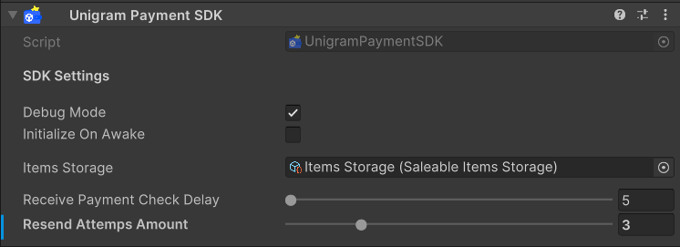

# UNIGRAM PAYMENT

[](https://unity.com/releases/editor/archive)
[](package.json)
[](LICENSE)


<p align="left">
 
</p>

**UNIGRAM PAYMENT** is a library for making payments inside web applications made on Unity using a new internal currency - Telegram Stars. No need to connect payment providers as it was before.

# Technical Demo

You can test the SDK without installation in the TMA (Telegram Mini App) demo [via Telegram bot](https://t.me/UnigramPayment_bot/launch).

# Dependencies

Install the following plugins/libraries for the SDK to work correctly:

- **[Newtonsoft](https://www.youtube.com/watch?v=3H6xkl_EsvQ)** - modern solution for convenient work with json files.

**P.S:** Newtonsoft 3.2+ adds 2.5 MB to the web build, but if you don't need the new features or complex types in your project, I RECOMMEND using the [10-year-old version](https://github.com/SaladLab/Json.Net.Unity3D) (adds only 350-500 KB, depending on the package type).

# Installation

**[Download the latest version of the SDK via the .unityPackage file here](https://github.com/MrVeit/Veittech-UnigramPayment/releases).**

# Initialization

### Initializing backend components

Before you start testing the library in your project, you need to set up the base, without which it will not work.
To do this, it is necessary to run locally `Server API` and `Telegram Bot`, in which the logic of payments will be conducte.

To do this, you need to make a clone of the Server API repository that is written in Node.js:
```
https://github.com/MrVeit/Veittech-UnigramPayment-ServerAPI
```
And also a clone of the Telegram Bot repository, which is also written in Node.js:
```
https://github.com/MrVeit/Veittech-UnigramPayment-TelegramBot
```

If you already have Node.js installed on your PC `running Windows` (does anyone make Unity games on Linux? :D), you can skip this step and move on to the next one. If you still don't have it installed, you need to go to the official Node.js website and [install it yourself](https://nodejs.org/en/).

After installing and cloning the above two repositories, you can open both projects in `VS Code` or `any other code editor` that **supports Node.js**.

Now, to be able to run these projects locally and start testing, you need to create a repository environment variable. To do this, you need to create a file named `.env` but **without a file format** in the directory of both repositories.

For the API Server repository environment variable, you need to fill in the following information:

```config
SERVER_DOMAIN = http://localhost

BOT_TOKEN = YOUR_BOT_TOKEN
BOT_SECRET_KEY = "test_app_unigram_payment"

CLIENT_SECRET_KEY = "test_unity_unigram"
CLIENT_JWT_SIGN = "unigram_payment-unity"
```

- The `SERVER_DOMAIN` variable is a link to your domain where the API server is running, for the purposes of testing we will use the local address `http://localhost`,

- The `BOT_TOKEN` variable is the token of your Telegram bot, which can be created in [Bot Father](https://t.me/BotFather) inside Telegram by following the following simple steps. After creating the bot, you need to enter the command in **`/mybots`** and then go to the following path: `Select your bot -> Go to API Token -> Copy the value from there -> Paste the variable value without quotes`,

- The `BOT_SECRET_KEY` variable is the signature key by which the API server will identify your bot when it receives a check for payment. Ignoring third-party requests if they do not match this value, after decrypting the bot token.
Here you can use a pair of two words or one with numbers, using any special characters.
**IMPORTANT:** Store this key securely, it should not be public,

- The `CLIENT_SECRET_KEY` variable is the same signature key as the previous one, but for your Unity game. With it, before creating a payment request, you will need to authorize on the API server. **IMPORTANT:** It must also be stored securely and must not be public,

- The `CLIENT_JWT_SIGN` variable is an additional signing key with which your Unity game, after authorizing to the API server and receiving a generated JWT token, is signed with this key. Then, when requesting other API methods, the Unity game sends this generated JWT token in the Authorization header, and the server decrypts the token value with this key to allow access to its functionality if the values match.

For the Telegram bot, the environment variables will look like this:
```config
BOT_TOKEN = YOUR_BOT_TOKEN
SERVER_DOMAIN = http://localhost:1000

AUTHORIZATION_SECRET_KEY = "test_app_unigram_payment"
```

- The `BOT_TOKEN` variable should contain the bot token that you have previously filled in and inserted into a variable of the same name for the server API.
- The `SERVER_DOMAIN` variable is a reference to your API server. For testing purposes, leave the specified value unchanged.
- The `AUTHORIZATION_SECRET_KEY` variable should contain the same value that you filled in for `BOT_SECRET_KEY` for the API server.

Now you can run both projects to start testing. 
Open the terminal in the code editor in which you opened these projects and enter the following commands:

To activate the API server, enter the command:
```
node server.js
```

To activate the Telegram bot, enter the command:
```
npm start
```

**IMPORTANT:** In case you encounter a startup problem at this stage, it means you don't have Node.js installed or it was installed incorrectly.
Try reinstalling or searching for a solution to your problem on the Internet.

### Initializing the Unity Client

Once the necessary backend components have been successfully installed and running, you can start customizing your Unity project.

#### Automatic Initialization
The `UnigramPaymentSDK` component has an option `Initialize On Awake`. When it is activated, the SDK is initialized automatically. You will only have to subscribe to the necessary events and start working with it.

<p align="center">
 
</p>

#### Manual Initialization
Below is a test example of what this might look like:

```c#
public sealed class UsageTemplate : MonoBehaviour
{
    private UnigramPaymentSDK _unigramPayment;

    private void OnDisable()
    {
        _unigramPayment.OnInitialized -= UnigramPaymentInitialized;
    }

    private void Start()
    {
        _unigramPayment = UnigramPaymentSDK.Instance;

        _unigramPayment.OnInitialized += UnigramPaymentInitialized;

        _unigramPayment.Initialize();
    }

    private void UnigramPaymentInitialized(bool isSuccess)
    {
        if (isSuccess)
        {
            Debug.Log("Success initialize Unigram Payment SDK");
        }
    }
}
```

### Possible problems

After writing a script to initialize the SDK. You may encounter a number of errors because the configuration of the connection to the test API server is not yet set up.

So you need to go to the configuration window via `Unigram Payment -> API Config`.
Now you need to fill the `Client Secret Key` field with the value you previously entered for the API server variable `CLIENT_SECRET_KEY`.
You can leave the `Server Url` field unchanged if you want to do local testing.

<p align="center">
 
</p>

# Usage Template

Now it's time to look at examples of using the Unigram Payment `library API`.
After successful initialization, you can create a test invoice for payment.

**IMPORTANT:** the library makes a special storage with products in the form of Scriptable Object, the configuration of which contains such fields as: `Id`, `Name`, `Description` and its `Price` in Telegram Stars.

You can find this storage by going to `Assets -> Unigram Payment -> Items Storage`. To add your own items, right click on the project window and go to `Create -> Unigram Payment -> Saleable Item`.

### Creating a payment invoice

Below you can see an example of creating an invoice to pay for an item in Telegram Stars:

```c#
public sealed class UsageTemplate : MonoBehaviour
{
    [SerializeField, Space] private Button _createInvoiceButton;
    [SerializeField, Space] private SaleableItemsStorage _itemsStorage;

    private UnigramPaymentSDK _unigramPayment;

    private string _latestInvoice;

    private void OnDisable()
    {
        _createInvoiceButton.onClick.RemoveListener(CreateInvoice);

        _unigramPayment.OnInitialized -= UnigramPaymentInitialized;

        _unigramPayment.OnInvoiceLinkCreated -= PaymentInvoiceCreated;
        _unigramPayment.OnFullInvoiceLinkCreateFailed -= PaymentInvoiceCreateFailed;
    }

    private void Start()
    {
        _createInvoiceButton.onClick.AddListener(CreateInvoice);

        _unigramPayment = UnigramPaymentSDK.Instance;

        _unigramPayment.OnInitialized += UnigramPaymentInitialized;

        _unigramPayment.OnInvoiceLinkCreated += PaymentInvoiceCreated;
        _unigramPayment.OnFullInvoiceLinkCreateFailed += PaymentInvoiceCreateFailed;

        _unigramPayment.Initialize();
    }

    private void CreateInvoice()
    {
        var randomItemFromStorage = _itemsStorage.Items[Random.Range(0, _itemsStorage.Items.Count - 1)];

        Debug.Log($"Claimed item with payload id: {randomItemFromStorage.Id}");

        _unigramPayment.CreateInvoice(randomItemFromStorage);
    }

    private void UnigramPaymentInitialized(bool isSuccess)
    {
        if (isSuccess)
        {
            Debug.Log("Success initialize Unigram Payment SDK");
        }
    }

    private void PaymentInvoiceCreated(string itemPayloadId, string invoiceLink)
    {
        _latestInvoice = invoiceLink;

        Debug.Log($"The link to purchase the test item {itemPayloadId} has been successfully generated: {url}");
    }

    private void PaymentInvoiceCreateFailed(string itemPayloadId, ErrorTypes reason)
    {
        Debug.LogError($"Failed to create a payment link for item {itemPayloadId}, reason: {reason}");
    }
}
```

Now you will easily get a payment link, which you can open in your browser and pay in `your Telegram bot` if it was launched locally.

In case the payment link could not be successfully created based on the product configuration, you can subscribe to the `OnFullInvoiceLinkCreateFailed` event, where in addition to the product ID, the reason will be specified via `ErrorTypes`.

**IMPORTANT:** Processing a callback with receipt of payment check and subsequent refund **NOT AVAILABLE IN EDITOR**. So you need to create an assembly for WebGL and upload it to `Github Pages` or anywhere else where you have an `HTTPS Connection` and a valid `SSL Certificate` (I won't describe a detailed tutorial here, as you can find that online).

**P.S:** for detailed information on how to properly build a project with the Unigram Payment library, go to the [`Build`](https://github.com/MrVeit/Veittech-UnigramPayment#build) section.

### Invoice opening and payment

The following shows the implementation of opening and paying an invoice. The result is processed through appropriate callbacks from receipt of the check when payment is successful or unsuccessful:

```c#
public sealed class UsageTemplate : MonoBehaviour
{
    [SerializeField, Space] private Button _createInvoice;
    [SerializeField] private Button _openInvoice;
    [SerializeField, Space] private SaleableItemsStorage _itemsStorage;

    private UnigramPaymentSDK _unigramPayment;

    private SaleableItem _itemForPurchase;
    private PaymentReceiptData _itemPaymentReceipt;

    private string _latestInvoice;

    private void OnDisable()
    {
        _createInvoice.onClick.RemoveListener(CreateInvoice);
        _openInvoice.onClick.RemoveListener(OpenInvoice);

        _unigramPayment.OnInitialized -= UnigramPaymentInitialized;

        _unigramPayment.OnInvoiceLinkCreated -= PaymentInvoiceCreated;
        _unigramPayment.‎OnFullInvoiceLinkCreateFailed -= PaymentInvoiceCreateFailed;

        _unigramPayment.OnItemPurchased -= ItemPurchased;
        _unigramPayment.OnFullItemPurchaseFailed  -= ItemPurchaseFailed;
    }

    private void Start()
    {
        _createInvoice.onClick.AddListener(CreateInvoice);
        _openInvoice.onClick.AddListener(OpenInvoice);

        _unigramPayment = UnigramPaymentSDK.Instance;

        _unigramPayment.OnInitialized += UnigramPaymentInitialized;

        _unigramPayment.OnInvoiceLinkCreated += PaymentInvoiceCreated;
        _unigramPayment.‎OnFullInvoiceLinkCreateFailed += PaymentInvoiceCreateFailed;

        _unigramPayment.OnItemPurchased += ItemPurchased;
        _unigramPayment.OnFullItemPurchaseFailed  += ItemPurchaseFailed;

        _unigramPayment.Initialize();
    }

    private void CreateInvoice()
    {
        _itemForPurchase = _itemsStorage.Items[Random.Range(0, _itemsStorage.Items.Count - 1)];

        Debug.Log($"Claimed item with payload id: {_itemForPurchase.Id}");

        _unigramPayment.CreateInvoice(_itemForPurchase);
    }
        
    private void OpenInvoice()
    {
        _unigramPayment.OpenInvoice(_latestInvoice, _itemForPurchase.Id);
    }

    private void UnigramPaymentInitialized(bool isSuccess)
    {
        if (isSuccess)
        {
            Debug.Log("Success initialize Unigram Payment SDK");
        }
    }

    private void PaymentInvoiceCreated(string itemPayloadId, string invoiceLink)
    {
        _latestInvoice = invoiceLink;

        Debug.Log($"The link to purchase the test item {itemPayloadId} has been successfully generated: {url}");
    }

    private void PaymentInvoiceCreateFailed(string itemPayloadId, ErrorTypes reason)
    {
        Debug.LogError($"Failed to create a payment link for item {itemPayloadId}, reason: {reason}");
    }

    private void ItemPurchased(PaymentReceiptData receipt)
    {
        _itemPaymentReceipt = receipt;

        Debug.Log($"The item with identifier {_itemPaymentReceipt.InvoicePayload} " +
                $"was successfully purchased for {_itemPaymentReceipt.Amount} " +
                $"stars by the buyer with telegram id {_itemPaymentReceipt.BuyerId}");
    }

    private void ItemPurchaseFailed(SaleableItem failedPurchaseItem, ErrorTypes reason)
    {
        Debug.LogError($"Failed to purchase an item {failedPurchaseItem.Name}, reason: {reason}");
    }
}
```

When called to open a **previously generated invoice**, you will be presented with a native Pop up window to make a payment, which you can close without payment or pay - the results of both cases will be processed by the SDK.

P.S: If for some reason an attempt to pay a previously created invoice fails - the cdk will output the result in the `OnFullItemPurchaseFailed` event, where in addition to the configuration of the unsuccessfully purchased item the reason in `ErrorTypes` will be available.

### Creating and paying invoice

As of version `1.0.7`, a method is now available to immediately request the creation of an invoice based on the product configuration, and to open a payment window.

```c#
public sealed class UsageTemplate : MonoBehaviour
{
    [SerializeField, Space] private Button _payInvoice;
    [SerializeField, Space] private SaleableItemsStorage _itemsStorage;

    private UnigramPaymentSDK _unigramPayment;

    private SaleableItem _itemForPurchase;
    private PaymentReceiptData _itemPaymentReceipt;

    private void OnDisable()
    {
        _payInvoice.onClick.RemoveListener(PayInvoice);

        _unigramPayment.OnItemPurchased -= ItemPurchased;
        _unigramPayment.OnFullItemPurchaseFailed -= ItemPurchaseFailed;
    }

    private void Start()
    {
        _payInvoice.onClick.AddListener(PayInvoice);

        _unigramPayment = UnigramPaymentSDK.Instance;

        _unigramPayment.OnItemPurchased += ItemPurchased;
        _unigramPayment.OnFullItemPurchaseFailed += ItemPurchaseFailed;
    }

    private void PayInvoice()
    {
        if (!_unigramPayment.IsInitialized)
        {
             return;
        }

        _itemForPurchase = _itemsStorage.Items[Random.Range(0, _itemsStorage.Items.Count - 1)];

        Debug.Log($"Claimed item with payload id: {_itemForPurchase.Id}");

        _unigramPayment.PayInvoice(_itemForPurchase);
    }

    private void ItemPurchased(PaymentReceiptData receipt)
    {
        _itemPaymentReceipt = receipt;

        Debug.Log($"The item with identifier {_itemPaymentReceipt.InvoicePayload} " +
                $"was successfully purchased for {_itemPaymentReceipt.Amount} " +
                $"stars by the buyer with telegram id {_itemPaymentReceipt.BuyerId}");
    }

    private void ItemPurchaseFailed(SaleableItem failedPurchaseItem, ErrorTypes reason)
    {
        Debug.LogError($"Failed to purchase an item {failedPurchaseItem.Name}, reason: {reason}");
    }
}
```

**IMPORTANT:** It is recommended to display some sort **of loading screen before running** this method, as it may take some time to process before the payment window opens.

### Payment refund

The following shows the implementation of a call to return a previously paid invoice:

```c#
public sealed class UsageTemplate : MonoBehaviour
{
    [SerializeField, Space] private Button _refundPayment;
    [SerializeField, Space] private SaleableItemsStorage _itemsStorage;

    private UnigramPaymentSDK _unigramPayment;

    private PaymentReceiptData _itemPaymentReceipt;

    private void OnDisable()
    {
        _refundPayment.onClick.RemoveListener(Refund);

        _unigramPayment.OnItemPurchased -= ItemPurchased;
        _unigramPayment.OnFullItemPurchaseFailed -= ItemPurchaseFailed;

        _unigramPayment.OnRefundTransactionFinished -= RefundTransactionFinished;
        _unigramPayment.OnFullRefundTransactionFailed -= RefundTransactionFailed;
    }

    private void Start()
    {
        _refundPayment.onClick.AddListener(Refund);

        _unigramPayment = UnigramPaymentSDK.Instance;

        _unigramPayment.OnItemPurchased += ItemPurchased;
        _unigramPayment.OnFullItemPurchaseFailed += ItemPurchaseFailed;

        _unigramPayment.OnRefundTransactionFinished += RefundTransactionFinished;
        _unigramPayment.OnFullRefundTransactionFailed += RefundTransactionFailed;
    }

    private void Refund()
    {
        if (!_unigramPayment.IsInitialized)
        {
            return;
        }

        _unigramPayment.Refund(_itemPaymentReceipt);
    }

    private void UnigramPaymentInitialized(bool isSuccess)
    {
        if (isSuccess)
        {
            Debug.Log("Success initialize Unigram Payment SDK");
        }
    }

    private void ItemPurchased(PaymentReceiptData receipt)
    {
        _itemPaymentReceipt = receipt;

        Debug.Log($"The item with identifier {_itemPaymentReceipt.InvoicePayload} " +
                $"was successfully purchased for {_itemPaymentReceipt.Amount} " +
                $"stars by the buyer with telegram id {_itemPaymentReceipt.BuyerId}");
    }

    private void ItemPurchaseFailed(SaleableItem failedPurchaseItem, ErrorTypes reason)
    {
        Debug.LogError($"Failed to purchase an item {failedPurchaseItem.Name}, reason: {reason}");
    }

    private void RefundTransactionFinished(string transactionId, bool isSuccess)
    {
        if (isSuccess)
        {
            Debug.Log("The process of refunding the purchased stars through the transaction with" +
                    $" the identifier `{transactionId}` " +
                    $"has been completed successfully");
        }
    }

    private void RefundTransactionFailed(string transactionId, ErrorTypes reason)
    {
        Debug.LogError($"Failed to refund transaction by id: {transactionId}, reason: {reason}");
    }
}
```

After you request a payment refund, the API server contacts the Telegram API for the specified `transaction id` and `buyer id`. The next step is to check if this payment from this user has been in your Telegram bot at all or if it has been previously refunded. After receiving the result, you can display some notification to the user about successful or unsuccessful refund.

If the attempt to refund a payment fails, the cdk will return detailed information in the `OnFullRefundTransactionFailed` event with the failed transaction id and the reason in `ErrorTypes`.

### Access token update

The API server access token has an expiration date, which you can change at your discretion in the `session.js` script on the server **(by default it is valid for an hour)**. 

After this expires, access to the API for your Unity client is closed, and you need to upgrade. The SDK provides an **automatic token update** if a failed request to the server is made with the corresponding error **Unauthorized client, access denied**. 

In case the client session expired while using the application, you can get its result in the form of an `ErrorTypes.SessionExpired` error in one of the methods that is related to processing a purchase invoice.

If you want to manually refresh the access token, then call the `UnigramPaymentSDK.Instance.RefreshToken()` method and subscribe to the successful refresh result `UnigramPaymentSDK.Instance.OnSessionTokenRefreshed`.

# Build

Before you start building your unity project in WebGl, you need to do a few things to get the library **working properly.**

Go to the `Build Settings` window, then open `Project Settings -> Player -> Resolution and Presentation` and select the `Unigram Pay` build template. To display correctly in Telegram Web View, you need to set `Default Canvas Width` to 1080 and `Default Canvas Height` to 1920, and disable the `Run in Background` option.

<p align="center">
 
</p>

These are all the necessary steps that need to be done for the project **to build successfully** and for the library functions **to work properly.**

**IMPORTANT:** If you have Stripping Level set to `High or above Minimal,` you may have problems **processing json data** from the library backend. Be sure to create a `link.xml` file and fill it so that all library functions work without errors.

# Production Backend Deploy

Here is a **step-by-step guide** to deploying an `API server` and a `Telegram bot` on your server.

As an example, we will use a `virtual server` on `OC Ubuntu` that was rented from this hosting provider (if you decide to rent a server from them too, go to [this link and get a sweet discount](https://aeza.net/?ref=482600)).

## Installation of required modules

Once we have rented a virtual server and connected to it via SSH, we can now install the required modules.

### Installing Git

Allows you to clone public/private repositories to your server.

1. Update the list of packages on the server:
```
sudo apt update
```

2. Installing a module:
```
sudo apt install git -y
```

3. After the installation is complete, enter this command to verify that the installation was successful:
```
git --version
```

### Installing Docker

Runs your project as an isolated container and greatly speeds up the process of running it on the server, without having to write a bunch of commands.

1. First, you need to download the base packages for Docker:
```
sudo apt install apt-transport-https ca-certificates curl software-properties-common -y
```

2. Now we need to add the official Docker GPG key:
```
curl -fsSL https://download.docker.com/linux/ubuntu/gpg | sudo gpg --dearmor -o /usr/share/keyrings/docker-archive-keyring.gpg
```

3. Now we need to add the docker repository to APT:
```
echo "deb [arch=$(dpkg --print-architecture) signed-by=/usr/share/keyrings/docker-archive-keyring.gpg] https://download.docker.com/linux/ubuntu $(lsb_release -cs) stable" | sudo tee /etc/apt/sources.list.d/docker.list > /dev/null
```

4. Update the list of packages on the server:
```
sudo apt update
```

5. Check that Docker will be installed from the official repository with the current version:
```
apt-cache policy docker-ce
```

6. The long-awaited installation of Docker on the server:
```
sudo apt install docker-ce -y
```

### Installing Make

Allows you to quickly deploy/stop/delete your projects on the server, without having to type a bunch of commands.

1. Update the list of packages on the server:
```
sudo apt update
```

2. Installing a package:
```
sudo apt install build-essential -y
```

3. Check that the module has been installed correctly:
```
make --version
```

### Installing Nginx

The web server, which in this example will `proxy all requests` to your API server when you send `GET` and `POST` requests to your server's IP address or domain.

1. Update the list of packages on the server:
```
sudo apt update
```

2. Installing a package:
```
sudo apt install nginx -y
```

3. Now it is necessary to check the status of Nginx operation:
```
sudo systemctl status nginx
```

4. Go to the IP address of your server in your browser:
```
http://YOUR_SERVER_IP_ADDRESS
```

After the correct installation, you need to make sure that `port 80` is open on the server.
If Nginx is successfully installed and working correctly, you will **see a welcome page.**

## Configuring components

### Configuring HTTPS connection

Telegram has very strict rules regarding requests to third-party resources from Telegram bots. Therefore, it is necessary to add the ability to connect to the API server via HTTPS 

**P.S:** In general, this is a very important point, because with HTTP connection data can be quietly listened to by third parties, which entails information leakage and danger for your users).

To proceed, you need to **register a domain** for your server so that you can install the certificate there.

You can do this [right here](https://my.aeza.net/order/domain) if you have already clicked the link and received a [nice discount at checkout](https://aeza.net/?ref=482600).

Once you have connected your server's IP address in the domain settings, you can start setting up the connection.
If you don't have a reliable SSL certificate, you can generate one with a few commands.

1. Update the list of packages on the server:
```
sudo apt update
```

2. Install the package and plugin for Nginx:
```
sudo apt install certbot python3-certbot-nginx -y
``` 

3. Obtaining SSL certificate:
```
sudo certbot --nginx -d YOUR_DOMAIN_NAME
```

In the `YOUR_DOMAIN_NAME` field, write the address of the leased domain that you should have previously purchased at this point.

Follow the on-screen instructions to complete the process, many of which you can skip by pressing the `Enter` button. 
Certbot will prompt you to choose whether to redirect `HTTP` traffic to `HTTPS`, which is recommended for security.

### Configuring API server configuration

1. Now you need to go to the nginx configuration directory and create a configuration for your API server:
```
cd /etc/nginx/sites-available/
```

2. Create a configuration with the name of your domain:
```
nano YOUR_DOMAIN_NAME
```

3. Copy and paste this configuration data, but replace `YOUR_DOMAIN_NAME` with your domain:

```nginx

server
{
    listen 80;
    server_name YOUR_DOMAIN_NAME;

    if ($host = YOUR_DOMAIN_NAME) {
        return 301 https://$host$request_uri;
    }
}

server
{
   listen 443 ssl;
   server_name YOUR_DOMAIN_NAME;

   ssl_certificate /etc/letsencrypt/live/YOUR_DOMAIN_NAME/fullchain.pem; # managed by Certbot
   ssl_certificate_key /etc/letsencrypt/live/YOUR_DOMAIN_NAME/privkey.pem; # managed by Certbot
   include /etc/letsencrypt/options-ssl-nginx.conf; # managed by Certbot
   ssl_dhparam /etc/letsencrypt/ssl-dhparams.pem; # managed by Certbot

   location /api {
     proxy_pass http://localhost:1000;
     proxy_set_header Host $host;
     proxy_set_header X-Real-IP $remote_addr;
     proxy_set_header X-Forwarded-For $proxy_add_x_forwarded_for;
     proxy_set_header X-Forwarded-Proto $scheme;

     add_header 'Access-Control-Allow-Origin' '*' always;
     add_header 'Access-Control-Allow-Methods' 'GET, POST, PUT, DELETE, OPTIONS' always;
     add_header 'Access-Control-Allow-Headers' 'Origin, Content-Type, Accept, Authorization' always;

     if ($request_method = OPTIONS) {
      return 204;
     }

     add_header 'X-Content-Type-Options' 'nosniff';
     add_header 'Server' 'nginx';
     add_header 'Cache-Control' 'no-store, no-cache, must-revalidate, proxy-revalidate, max-age=0';
   }
}
```

Also, in addition to setting up nginx, in this configuration we set up mandatory headers so that the connection succeeds and is not blocked.

**IMPORTANT:** Failure to do so will result in an attempt to send `any GET/POST` request from your Web App **inside Telegram being blocked.**

4. Create a symbolic link to your configuration in the sites-enabled directory:
```
sudo ln -s /etc/nginx/sites-available/YOUR_DOMAIN_NAME /etc/nginx/sites-enabled/
```

5. Check the Nginx configuration for syntax errors:
```
sudo nginx -t
```

**IMPORTANT:** In case you see `syntax is OK`, you can proceed to the next step.

6. Reboot Nginx to apply the new configuration:
```
sudo systemctl restart nginx
```

## Deploy

### Deploy API Server

After installing all the necessary modules and setting up the necessary configurations, you can start to deploy the API server.

1. Go to the main directory of the server:
```
cd /root/
```

2. Clone the repository with the API server into the root directory:
```
git clone https://github.com/MrVeit/Veittech-UnigramPayment-ServerAPI.git
```

3. Get the contents of the directory:
```
ls -l
```

4. Navigate to the server API files:
```
cd Veittech-UnigramPayment-ServerAPI/src
```

5. Now we need to create a file with the storage of environment variables that are used in the project:
```
nano .env
```

We have already created it earlier [at this stage](https://github.com/MrVeit/Veittech-UnigramPayment?tab=readme-ov-file#initializing-backend-components), so copy and paste these values:
The value of the `SERVER_DOMAIN` variable replace it with the domain of your server that you previously rented, binding it to the server.

6. Start building and creating a docker container with an API server with a single command:
```
make run
```

7. To verify that the docker container is running, enter the following command:
```
docker ps
```

**P.S:** If the container is successfully started, you will see its name in the list, its id, and the time since it was started.

8. After the deploy, check the docker container logs to make sure no errors occurred:
```
make logs
```

In case the launch **was successful**, you will see only 1 line in the logs: `API Server running at YOUR_DOMAIN_NAME`.
Your API server is now running on the server and ready to accept requests from your client on Unity.

### Deploy Telegram Bot

Once the basic set of modules has been installed, you can start running one of the projects.

1. Navigate to the main directory of the server:
```
cd /root/
```

2. Clone the repository with the telegram bot into the root directory of the server:
```
git clone https://github.com/MrVeit/Veittech-UnigramPayment-TelegramBot.git
```

3. Get the contents of the directory:
```
ls -l
```

4. Navigate to the Telegram Bot files:
```
cd Veittech-UnigramPayment-TelegramBot/src
```

**IMPORTANT:** Repeat the same steps starting from step 5 that you did to deploy your API server, they are **exactly the same.**

After you have launched the second container with your Telegram bot, you can go to it and check its functionality.

# Donations

Ton Wallet (TON/NOT/USDt):
```
UQDPwEk-cnQXEfFaaNVXywpbKACUMwVRupkgWjhr_f4Ursw6
```

Multichain Wallet (BTC/ETH/BNB/MATIC)
```
0x231803Df809C207FaA330646BB5547fD087FEcA1
```

**Thanks for your support!**

# Support

[](https://mail.google.com/mail/?view=cm&fs=1&to=misster.veit@gmail.com)
[](https://t.me/unigram_tools)
